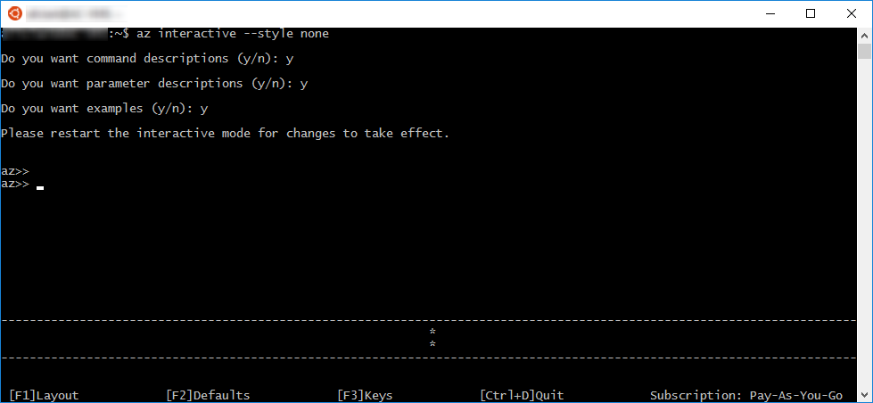
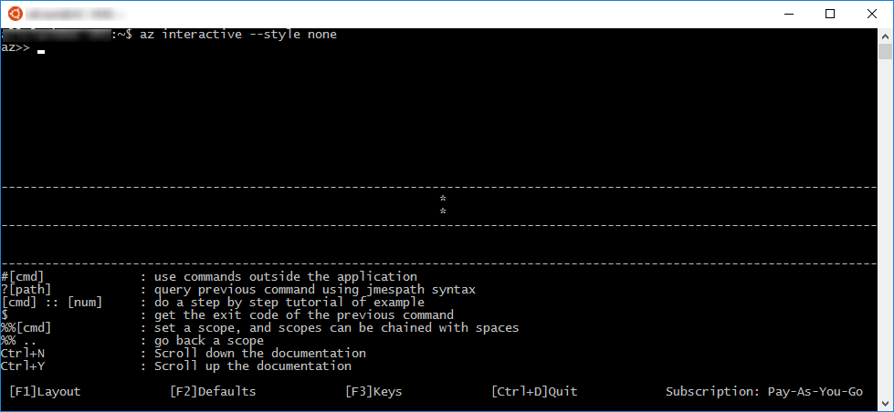

# <a name="interactive-azure-cli-20"></a><span data-ttu-id="1eb6d-104">Interfaccia della riga di comando di Azure 2.0 interattiva</span><span class="sxs-lookup"><span data-stu-id="1eb6d-104">Interactive Azure CLI 2.0</span></span>

<span data-ttu-id="1eb6d-105">È possibile usare l'interfaccia della riga di comando di Azure 2.0 in modalità interattiva eseguendo il comando `az interactive`.</span><span class="sxs-lookup"><span data-stu-id="1eb6d-105">You can use Azure CLI 2.0 in interactive mode by running the `az interactive` command.</span></span>
<span data-ttu-id="1eb6d-106">Questo consente di accedere a una shell interattiva in cui i comandi vengono completati automaticamente e sarà possibile accedere alle descrizioni dei comandi, nonché ai relativi parametri e agli esempi di comando.</span><span class="sxs-lookup"><span data-stu-id="1eb6d-106">That places you in an interactive shell where your commands are auto-completed and you have access to descriptions of commands and their parameters and command examples.</span></span>


> [!NOTE]
> <span data-ttu-id="1eb6d-108">Qui non viene usato lo stile predefinito, che non viene letto anche su sfondo nero.</span><span class="sxs-lookup"><span data-stu-id="1eb6d-108">We're not using the default style here, which doesn't read as well on a black background.</span></span>

<span data-ttu-id="1eb6d-109">Se l'utente non ha effettuato l'accesso al proprio account, usare il comando `login` per eseguire questa operazione.</span><span class="sxs-lookup"><span data-stu-id="1eb6d-109">If you're not already logged in to your account, use the `login` command to do that.</span></span>

## <a name="configure"></a><span data-ttu-id="1eb6d-110">Configurare</span><span class="sxs-lookup"><span data-stu-id="1eb6d-110">Configure</span></span>

<span data-ttu-id="1eb6d-111">La modalità interattiva mostra, facoltativamente, le descrizioni dei comandi, le descrizioni dei parametri ed esempi di comando.</span><span class="sxs-lookup"><span data-stu-id="1eb6d-111">Interactive mode optionally displays command descriptions, parameter descriptions, and command examples.</span></span>
<span data-ttu-id="1eb6d-112">È possibile attivare o disattivare descrizioni ed esempi tramite `F1`.</span><span class="sxs-lookup"><span data-stu-id="1eb6d-112">You can turn descriptions and examples on or off using `F1`.</span></span>



<span data-ttu-id="1eb6d-114">È possibile attivare o disattivare la visualizzazione dei valori predefiniti dei parametri usando `F2`.</span><span class="sxs-lookup"><span data-stu-id="1eb6d-114">You can turn the display of parameter defaults on or off using `F2`.</span></span>


<span data-ttu-id="1eb6d-116">`F3` attiva o disattiva la visualizzazione di alcuni movimenti chiave.</span><span class="sxs-lookup"><span data-stu-id="1eb6d-116">`F3` toggles the display of some key gestures.</span></span>



## <a name="scope"></a><span data-ttu-id="1eb6d-118">Scope</span><span class="sxs-lookup"><span data-stu-id="1eb6d-118">Scope</span></span>

<span data-ttu-id="1eb6d-119">È possibile definire un ambito della modalità interattiva per un gruppo di comandi specifici come `vm` o `vm image`.</span><span class="sxs-lookup"><span data-stu-id="1eb6d-119">You can scope your interactive mode to a specific command group like `vm` or `vm image`.</span></span>
<span data-ttu-id="1eb6d-120">Quando si esegue questa operazione, tutti i comandi vengono interpretati in tale ambito.</span><span class="sxs-lookup"><span data-stu-id="1eb6d-120">When you do, all commands are interpreted in that scope.</span></span>
<span data-ttu-id="1eb6d-121">È una sintassi abbreviata ideale se si sta effettuando il lavoro in tale gruppo di comandi.</span><span class="sxs-lookup"><span data-stu-id="1eb6d-121">It's a great shorthand if you're doing all your work in that command group.</span></span>

<span data-ttu-id="1eb6d-122">Anziché digitare i comandi seguenti:</span><span class="sxs-lookup"><span data-stu-id="1eb6d-122">Instead of typing these commands:</span></span>

```azurecli
az>> vm create -n myVM -g myRG --image UbuntuLTS
az>> vm list -o table
```

<span data-ttu-id="1eb6d-123">È possibile definire l'ambito per il gruppo di comandi della macchina virtuale e digitare i comandi seguenti:</span><span class="sxs-lookup"><span data-stu-id="1eb6d-123">You can scope to the vm command group and type these commands:</span></span>

```azurecli
az>> %%vm
az vm>> create -n myVM -g myRG --image UbuntuLTS
az vm>>list -o table
```

<span data-ttu-id="1eb6d-124">È possibile definire l'ambito anche per gruppi di comandi di livello inferiore.</span><span class="sxs-lookup"><span data-stu-id="1eb6d-124">You can scope to lower-level command groups as well.</span></span>
<span data-ttu-id="1eb6d-125">È possibile definire l'ambito `vm image` usando `%%vm image`.</span><span class="sxs-lookup"><span data-stu-id="1eb6d-125">You could scope to `vm image` using `%%vm image`.</span></span>
<span data-ttu-id="1eb6d-126">In questo caso, poiché è già stato definito l'ambito per `vm`, useremo `%%image`.</span><span class="sxs-lookup"><span data-stu-id="1eb6d-126">In this case, since we're already scoped to `vm`, we would use `%%image`.</span></span>

```azurecli
az vm>> %%image
az vm image>>
```

<span data-ttu-id="1eb6d-127">A questo punto, potrebbe essere visualizzato il backup dell'ambito per `vm` usando `%%..` oppure è possibile definire l'ambito per la radice solo con `%%`.</span><span class="sxs-lookup"><span data-stu-id="1eb6d-127">At that point, we can pop the scope back up to `vm` using `%%..`, or we can scope to the root with just `%%`.</span></span>

```azurecli
az vm image>> %%
az>>
```

## <a name="query"></a><span data-ttu-id="1eb6d-128">Query</span><span class="sxs-lookup"><span data-stu-id="1eb6d-128">Query</span></span>

<span data-ttu-id="1eb6d-129">È possibile eseguire una query JMESPath sui risultati dell'ultimo comando eseguito.</span><span class="sxs-lookup"><span data-stu-id="1eb6d-129">You can execute a JMESPath query on the results of the last command that you executed.</span></span>
<span data-ttu-id="1eb6d-130">Ad esempio, dopo aver creato una macchina virtuale, è possibile assicurarsi che venga eseguito il provisioning completo.</span><span class="sxs-lookup"><span data-stu-id="1eb6d-130">For example, after you create a VM, you can make sure it has fully provisioned.</span></span>

```azurecli
az>> vm create --name myVM --resource-group myRG --image UbuntuLTS --no-wait
az>> ? [*].provisioningState
```

```
[
  "Creating"
]
```

<span data-ttu-id="1eb6d-131">Per altre informazioni sulle query ai risultati dei comandi, vedere [Effettuare query ai risultati dei comandi con Azure 2.0](query-azure-cli.md).</span><span class="sxs-lookup"><span data-stu-id="1eb6d-131">To learn more about querying the results of your commands, see [Query command results with Azure 2.0](query-azure-cli.md).</span></span>

## <a name="bash-commands"></a><span data-ttu-id="1eb6d-132">Comandi Bash</span><span class="sxs-lookup"><span data-stu-id="1eb6d-132">Bash commands</span></span>

<span data-ttu-id="1eb6d-133">È possibile eseguire i comandi della shell senza uscire dalla modalità interattiva tramite `#[cmd]`.</span><span class="sxs-lookup"><span data-stu-id="1eb6d-133">You can run shell commands without leaving interactive mode using `#[cmd]`.</span></span>

```azurecli
az>> #dir
```

## <a name="examples"></a><span data-ttu-id="1eb6d-134">esempi</span><span class="sxs-lookup"><span data-stu-id="1eb6d-134">Examples</span></span>

<span data-ttu-id="1eb6d-135">Alcuni comandi hanno numerosi esempi.</span><span class="sxs-lookup"><span data-stu-id="1eb6d-135">Some commands have lots of examples.</span></span>
<span data-ttu-id="1eb6d-136">È possibile passare alla pagina successiva di esempi tramite `CTRL-N` e alla pagina precedente tramite `CTRL-Y`.</span><span class="sxs-lookup"><span data-stu-id="1eb6d-136">You can scroll to the next page of examples using `CTRL-N` and the previous page using `CTRL-Y`.</span></span>


<span data-ttu-id="1eb6d-138">È anche possibile vedere un esempio specifico usando `::#`.</span><span class="sxs-lookup"><span data-stu-id="1eb6d-138">You can also look at a specific example using `::#`.</span></span>

```azurecli
az>> vm create ::8
```
